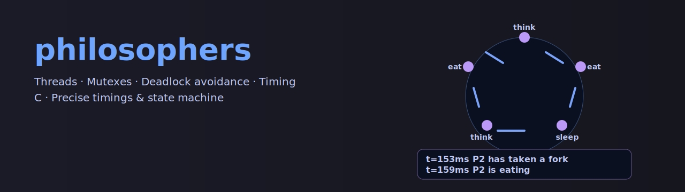

<!-- ===================== BANNER ===================== -->
<p align="center">
  
</p>

<!-- ===================== BADGES (ajusta/borra los que no apliquen) ===================== -->
<p align="center">
  
  
  
  <!-- CI opcional (si tienes workflow .github/workflows/build.yml):
  
  -->
  
  <!-- PRs welcome:
  
  -->
</p>

<h1 align="center">TODO_TITULO</h1>
<p align="center"><i>TODO_TAGLINE — una línea que diga qué hace el proyecto y por qué importa.</i></p>

---

## Índice
- [Resumen](#resumen)
- [Capturas / Demo](#capturas--demo)
- [Stack / Dependencias](#stack--dependencias)
- [Estructura](#estructura)
- [Instalación y uso](#instalación-y-uso)
- [Tests](#tests)
- [Rendimiento / Complejidad](#rendimiento--complejidad)
- [Roadmap](#roadmap)
- [Problemas conocidos](#problemas-conocidos)
- [Contribuir](#contribuir)
- [Licencia](#licencia)
- [Autor](#autor)

---

## Resumen
- **Qué**: TODO_descripción_corta (1–2 frases).
- **Para qué**: valor que aporta (p. ej., “aprendizaje de X”, “utilidad Y”).
- **Estado**: `alpha` / `estable` / `en progreso`.
- **Highlights**: 3 bullets de funciones o decisiones técnicas clave.

---

## Capturas / Demo
<!-- Deja una o varias imágenes / GIFs; guarda en assets/ -->
<p align="center">
  <!--  -->
  <!--  -->
  <i>Incluye aquí una imagen o GIF corto si aporta valor.</i>
</p>

---

## Stack / Dependencias
<!-- Elige la variante que aplique y elimina la otra -->

<!-- ===== Variante C / 42 ===== -->
- **Lenguaje**: C (C99/gnu11)
- **Build**: Makefile (`cc -Wall -Wextra -Werror`)
- **POSIX**: `unistd.h`, `fcntl.h`, `signal.h`, etc.
- **Opcional**: MiniLibX / pthreads / readline

<!-- ===== Variante Python / Datos ===== -->
<!--
- **Lenguaje**: Python 3.10+
- **Entorno**: venv / conda
- **Paquetes**: numpy, pandas, matplotlib, scipy, scikit-learn, jupyter
-->

---

## Estructura
```text
TODO_REPO/
├─ src/              # código fuente
├─ include/          # headers (si C)
├─ notebooks/        # *.ipynb (si Python)
├─ tests/            # mains de prueba o pytest
├─ assets/           # banner.svg, capturas
├─ Makefile          # si C/42
├─ requirements.txt  # si Python
└─ README.md
